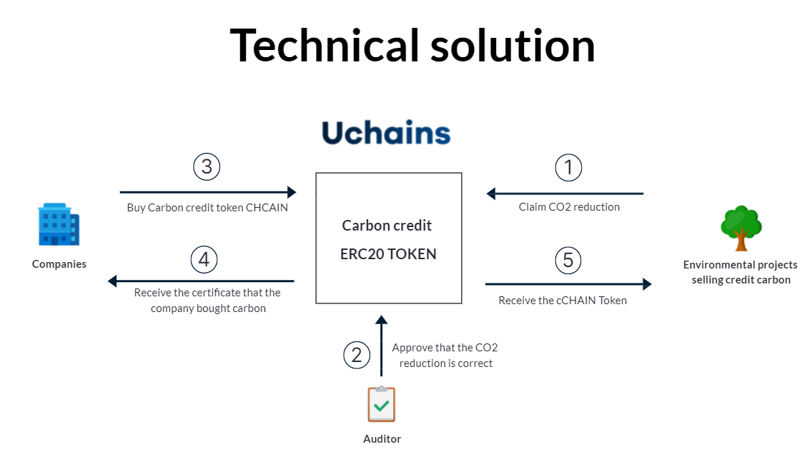

# cCHAIN Carbon Credit

A an ERC20 token backed by carbon credits - allows certified issuance, transfer and retirement.

## How It Works



1. The supplier purshase carbon credit for the CO2 he captured by a Climate Impact Project.
1. An auditor company like VERRA will control that this number is correct ans upload a certificate using IPFS deltails like PINATA
1. Uchains use a smart contract to call `depositCarbonCreditsFromCertificate` function on the carbon credit ERC20 token with the value of the certificate received.
1. The supplier have the certificate in his CELO Address and everybody can see it.
1. The company buying credit carbon will buy the eqCO2 in cCHAIN TOKEN
1. The supplier transfer the carbon credit to the buyer in cCHAIN TOKEN
1. Uchain will provide a certification to attest that the company have bought the ammount and in the same time, this amount is deleted from the marketplace to avoid double spending

# Deployment

## (1) Copy the `.env` file with

```
cp .env.example .env
```

## (2) Then fill in the `.env` values

for your Infura Ethereum node API key and Ethereum private key.

## (3) Install truffle globally

```
npm install -g truffle
```

## (4) Deploy the smart contracts

Deploy to `ropsten` testnet or another Ethereum blockchain network like `mainnet` with:

```
truffle deploy --compile-all --reset --network ropsten-infura
```

## (5) Write down your the contract address

So you can find the address on Etherscan or other networks. It will appear in the deploy output and look like this:

```
   Replacing 'CarbonCredit'
   ------------------------
   ...
   > contract address:    0x85ACf61EE09C3FC771013Cd2f5ddF891DA1C8D01
   ...
```
